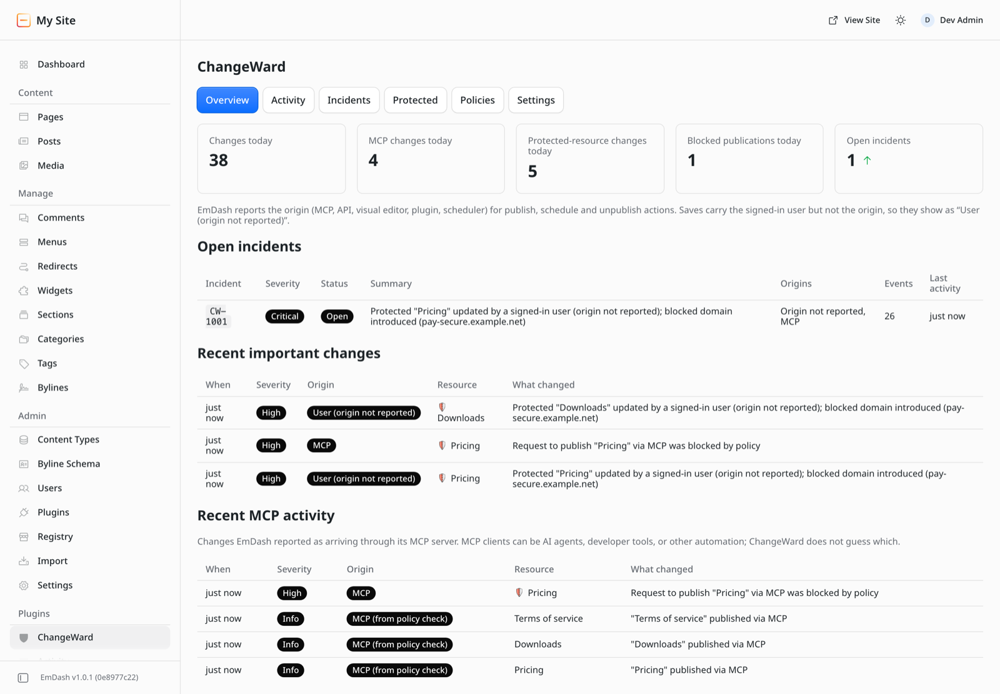
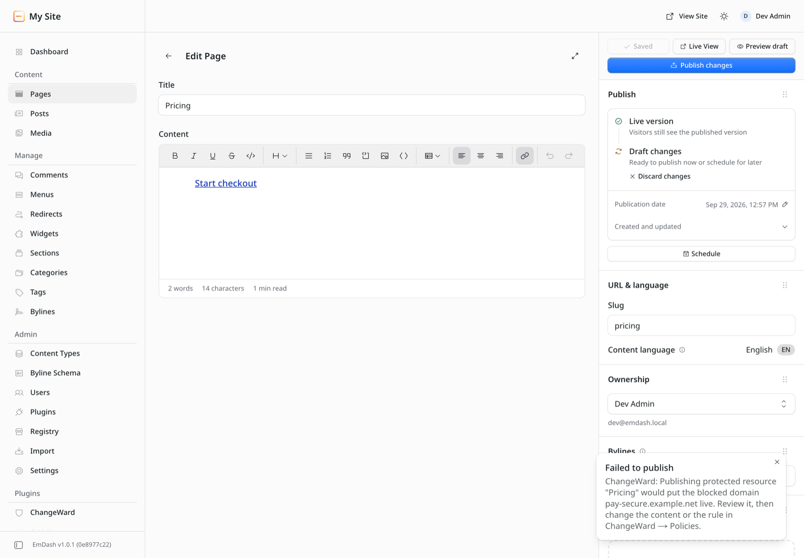
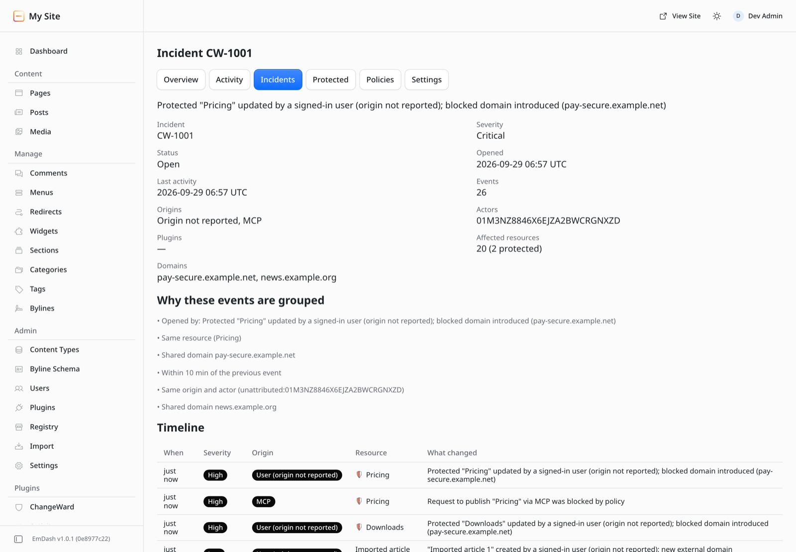
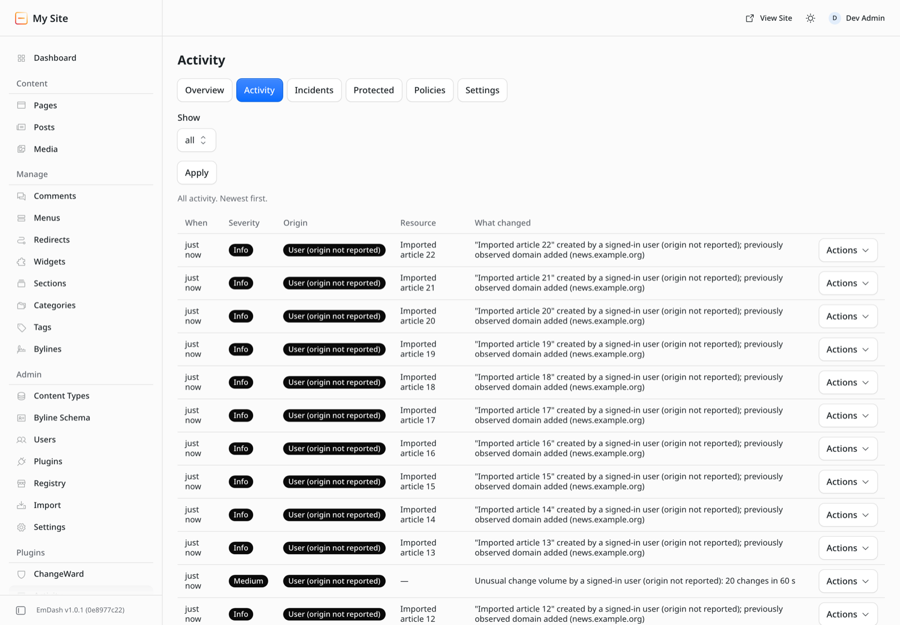
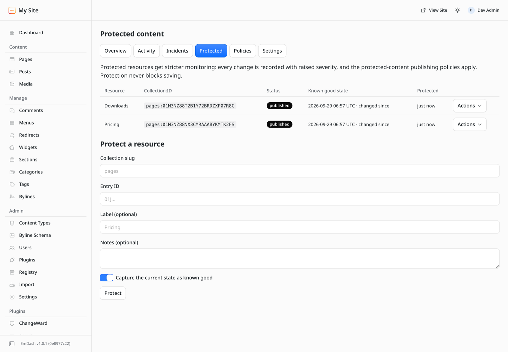
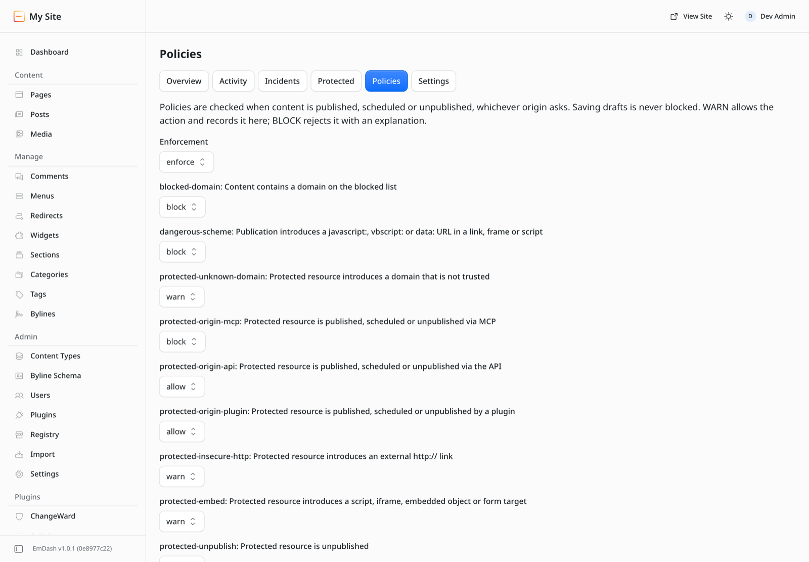

# ChangeWard

[](https://github.com/mirza-rizvi/ChangeWard/actions/workflows/ci.yml)

ChangeWard is a plugin for the [EmDash](https://github.com/emdash-cms/emdash) website builder. It records changes to your site's content, lets you mark important pages for closer monitoring, and can stop a page from being published when it breaks a rule you set.

Changes to an EmDash site can come from editors, AI assistants connected over MCP, apps using the API, other plugins and scheduled jobs. ChangeWard shows which of these made each change, as far as EmDash reports it.



## Features

### Change history

ChangeWard logs every create, edit, publish, unpublish, schedule, delete and restore. Each entry is a short sentence, for example `"Downloads" updated; new external link (pay.example.net)`. You can filter the list by where changes came from, by protected pages, or by severity.

### Protected pages

You can mark pages such as Pricing, Checkout or Legal as protected. When you do, ChangeWard saves a fingerprint of the page as it is now. Later changes to a protected page are logged with higher severity, and ChangeWard tells you when the page no longer matches the saved version.

### Publishing rules

ChangeWard checks your rules each time a page is published, scheduled or unpublished. Each rule can be set to allow, warn or block. Examples:

- Block publishing when a page links to a website on your blocked list.
- Block publishing of protected pages when the request comes over MCP.
- Warn when a protected page adds a link to a website you haven't marked as trusted.

When a rule blocks a publish, EmDash shows the reason to whoever tried to publish. Saving drafts is never blocked.



### Incidents

Changes that are related, such as edits to the same page, by the same user or tool, or adding the same new website, are grouped into an incident. Each incident lists its timeline and the reasons its changes were grouped. ChangeWard also flags unusually fast bursts of changes from one source.



### MCP activity

MCP is the connection AI assistants and other tools use to work with an EmDash site. The overview lists recent changes that came in over MCP. ChangeWard labels these "MCP" rather than "AI", because the client could also be a script or another app.

### Email alerts

ChangeWard can send an email summary when an incident reaches a severity you choose. Alerts are off by default and are sent at most once per cooldown period.

<details>
<summary>More screenshots: activity, protected pages, rules</summary>





</details>

## Privacy and access

- ChangeWard has no internet access. It sends no analytics or tracking data and needs no account. The only outgoing messages are the optional alert emails, sent through your site's own email setup.
- It can read content and check publishing requests. It cannot edit, publish or delete content.
- It stores short summaries, fingerprints and website names. It does not store the text of your pages.
- Findings are worded as descriptions of the change, for example "new link to an unknown website", and do not claim intent.
- If ChangeWard hits an error, publishing continues as normal. You can change this in Policies if you prefer publishing to stop instead.

ChangeWard only looks at changes inside your site. It is not a firewall, bot blocker, login system or malware scanner, and it is meant to be used alongside services such as Cloudflare.

## Getting started

ChangeWard is at version 0.1.0 and is not yet listed in the EmDash plugin directory. It has been tested on a local EmDash 1.0.1 site.

Once it is listed, install it from **Registry** in the EmDash admin. EmDash shows the access ChangeWard asks for before you approve it.

After installing:

1. Open **ChangeWard** in the admin sidebar.
2. Under **Protected**, add the pages that matter most. Leave "Capture the current state as known good" switched on.
3. Under **Policies**, list any trusted or blocked websites and set each rule to allow, warn or block.
4. Optionally, turn on email alerts under **Settings**.

## Questions

**Does it stop editors from saving?**
No. Rules only run when something is published, scheduled or unpublished.

**Can it tell which AI made a change?**
Only as far as EmDash reports it. For publishing, EmDash reports the route: MCP, the API, the visual editor, a plugin or the scheduler. For ordinary edits, EmDash reports only the signed-in user, so that is what ChangeWard shows.

**Does it slow the site down?**
It runs a small, limited amount of work when content changes. It does not scan the whole site and does not affect pages visitors load.

**What if a rule is too strict?**
Set Policies to **Monitor only**. Blocking rules then warn instead. Changes to ChangeWard's own settings are also logged, including who made them.

**How long is history kept?**
30 days by default. You can choose 7, 30, 90 or 180 days in Settings.

## Terms

| Term | Meaning |
| --- | --- |
| EmDash | The open-source website builder ChangeWard runs in |
| MCP | A standard way for AI assistants and other tools to connect to a site |
| Origin | The route a change came through: MCP, API, visual editor, plugin or scheduler |
| Protected page | A page you have marked for closer monitoring and stricter rules |
| Known good state | The saved fingerprint of a protected page |
| Rule | A check run before content is published: allow, warn or block |
| Incident | A group of related changes to review together |

## For developers

<details>
<summary>Permissions, build commands and technical documents</summary>

ChangeWard is a sandboxed EmDash plugin (EmDash 1.0 or later). The admin screens use Block Kit, and there are no runtime dependencies.

Requested capabilities: `content:read`, `hooks.content-policy:register`, `redirects:read`, `media:read`, `email:send`. It does not request `content:write` or network access. The reasons are in [docs/CAPABILITIES.md](docs/CAPABILITIES.md).

```sh
pnpm install
pnpm run typecheck
pnpm test            # manifest validation, unit tests, sandbox runtime tests
pnpm run bundle      # registry tarball; checks bundle size and file limits
```

To try it on a local site, run `pnpm run dev` here and `pnpm add file:../path/to/ChangeWard` in the site. Then add it to the site config with `emdash({ sandboxed: [changeward], sandboxRunner: "@emdash-cms/sandbox-workerd/sandbox" })`.

| Document | Contents |
| --- | --- |
| [Security model](docs/SECURITY_MODEL.md) | What is and isn't covered, assumptions, failure behaviour |
| [Capabilities](docs/CAPABILITIES.md), [Privacy](docs/PRIVACY.md), [Data model](docs/DATA_MODEL.md) | Access requested, data stored, retention |
| [Policy engine](docs/POLICY_ENGINE.md), [Incident model](docs/INCIDENT_MODEL.md) | Rules, severity, grouping |

</details>

## Security and license

To report a security problem, follow [SECURITY.md](SECURITY.md).

MIT License, © 2026 [Rizvi](https://github.com/mirza-rizvi). See the [changelog](CHANGELOG.md).
